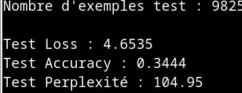
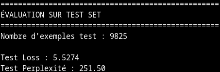
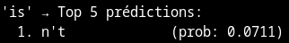
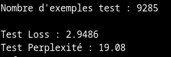
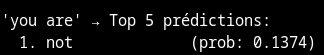
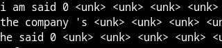
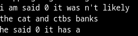
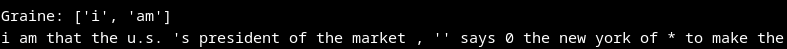
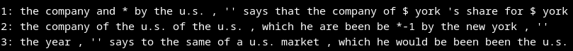
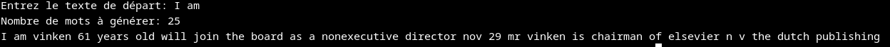

# Translation and natural languages with RNN and SEQ2SEQ

The goal is to understand how we can compute natural language with deep learning.
To do that we have to use Recurrent Neural Network.

The final goal is to try to do a simple system of english -> french translation.

### Our Approach

We start from the fundamentals of the recurrent neural network and progressively increase complexity :

1. **Word extension with RNN**
  i. Recurrent Neural Network (RNN)
  ii. How to turn words in vectors (Embeddings)
  iii Word Extension (bigram and trigram...)
2. **Generate sentences, how to remember things in our sentences**
  i. Our first sentences with RNN
  ii. LSTM and GRU to have more context
3. **Translation with seq2seq**
  i.Principle of seq2seq
  ii Our strategy
  iii our models

## Word Extension with RNN

### What is a recurrent neural network ?

**Recurrent Neurons**


A recurrent neuron (shown on the left of the image) has a self-loop that feeds its output back as input. In other words, the neuron receives both an external input and its own previous output.

Mathematically, this is expressed as:

$$
\begin{aligned}
S\_0 = o \\
S\_{t+1} = ρ((e\_{t+1} · S\_t) W\_r + b\_r) \\
o = S\_{t+1} W\_o + b\_o
\end{aligned}
$$

Where:
- `S_t` is the output at state at time `t`
- `e_{t+1}` is the input at time `t+1`
- `W_r` and `b_r` are the recurrent layer's weights and bias
- `ρ` is the activation function
- `W_o` and `b_o` are the output layer's weights and bias

Memory Through Time :
Basically, we can see in the equation $(e\_{t+1}⋅St)(e\_{t+1} \cdot S\_t)$ and especially $(e_{t+1}​⋅St​)$ that the output is mixed with the new input. This means the neuron is supposed to remember what happened in the past.

For instance, if we analyze a sentence word by word, at the second word we mix the output (which analyzed the first word) with the input of the second word. This is clearly better to understand a sentence, as we carry forward the context from previous words.
In this way, we can visualize the neuron through time by connecting it on a timeline, like in the right side of the image. We clearly see the equation has two inputs: the new one from the corpus and the output of the last sequence. This recurrent connection allows the network to maintain information about previous inputs and use it to process current ones.

### How to turn words in vectors ? (Embeddings)

Now that we have an idea of how to use RNNs to understand sentences, we need a way to convert words into vectors. It's much easier for computers to compute with floating-point numbers than with raw text.
The idea is to assign each word a vector in an n-dimensional space. In this space, words are positioned based on their semantic meaning and usage patterns. If the word "cat" is often followed by "eat," then the vectors for "cat" and "eat" should be positioned close to each other in this semantic space.
Example:

"cat" might be represented as [0.2, 0.8, 0.1, ...]
"dog" might be represented as [0.25, 0.75, 0.15, ...] (similar to "cat")
"pizza" might be represented as [0.1, 0.2, 0.9, ...] (different from "cat")

If we have n dimesions it's for having different features (n actually), for instance "cat", "dog" and "pizza" if we arein a 2-dimensional space the first dimension can be about being alive and the second being eatable, it's oversimplified but it's the idea.

#### How Embeddings Connect with RNNs

**Step 1: Tokenization to Embedding Lookup**

Words are first converted to numerical tokens, then these tokens are used to retrieve vectors from an embeddings matrix:

"dog" → token 238 → [0.2, 0.8, 0.1, ...]
"cat" → token 543 → [0.4, 0.1, 0.9, ...]

Each token acts as an index to fetch a corresponding vector representation. These vectors capture semantic relationships learned from the entire corpus during training.

**Step 2: Contextual Processing by the RNN**
The embedding vectors are then passed sequentially to the RNN, which processes them one word at a time while maintaining hidden state. The RNN's role is fundamentally different from embeddings:

Embeddings provide static vector representations based on global patterns in the data
RNN provides dynamic contextual understanding based on the sequence of words in the current sentence

The Key Distinction
Embeddings alone cannot understand that "bank" means something different in "river bank" versus "savings bank", they assign the same vector regardless of context. The RNN solves this by analyzing the surrounding words and previous words in the sequence.

#### Let's Make Our Embedding

To train the embedding, we need to prepare the data from the treebank corpus. Here's what happens at each step:

1. **Normalize the text** by
preventing the model from treating the same word differently based on capitalization, which would waste embedding capacity.
2. **Create a string representation** from the array representation
Convert each sentence from a list of words to a single string. This is needed for the tokenizer's fit_on_texts() method, which expects string inputs.
3. **Create the tokenizer** with unknown word handling
We also add <eos> (end-of-sentence) markers to mark sentence boundaries. vocab_size is the total number of unique words including special tokens.
4. **Create training sequences**
This creates a next-word-prediction task that forces the embedding to capture meaningful relationships between words.
5. **Convert words to token IDs**
The tokenizer converts each word string to its corresponding integer ID. Unknown words are mapped to the <unk> token ID. Now X_encoded and y_encoded are numerical arrays ready for training the neural network.

**Training the Embedding**

We build a simple model to train embeddings through next-word prediction:

>pythonlayers.Embedding(input_dim=vocab_size, output_dim=embed_dim, input_length=window_size)

How it works: The embedding converts tokens to vectors → Flatten concatenates them → Dense predicts the next word.
During backpropagation, gradients adjust the embedding vectors to predict correctly. Similar words (like "dog" and "cat") develop similar vectors because they appear in similar contexts. After training, we keep only the Embedding layer for reuse.

### Word Extension (Bigrams, Trigrams, ...)

Let us explain how we build word extension models (also known as *n-gram language models*).

The main idea is to estimate the probability of the next word given the previous ones.

For example, if we want to know how likely the word "am" follows "I", we are interested in the conditional probability:

$$
P(\text{am} \mid \text{I})
$$

More generally, let a sentence be a sequence of tokens:

$$
E\_{1:n} = (e\_1, e\_2, \dots, e_n)
$$

Using the chain rule of probability, the joint probability of the sequence is:

$$
P(E\_{1:n} = e\_{1:n}) = \prod\_{t=1}^{n} P(e\_t \mid e\_{1:t-1})
$$

This formulation is exact but impractical, since conditioning on all previous words quickly becomes infeasible.

#### Bigram model

In a bigram model, we approximate:

$$
P(e\_t \mid e\_{1:t-1}) \approx P(e\_t \mid e\_{t-1})
$$

Thus, the probability of a full sequence becomes:

$$
P(E\_{1:n}) \approx \prod\_{t=1}^{n} P(e\_t \mid e\_{t-1})
$$

This means that:
- The text is split into words (or tokens).
- To predict word $t$, we only need to know word $t-1$.

Since a bigram model only requires one previous word, it does not require memory like RNNs.

We can therefore use:
- an embedding layer to represent the previous word
- followed by a simple MLP (fully connected network) to predict the next word

This shows that our previous architecture (Embedding + MLP) is already sufficient. We only need to adapt how we train and evaluate the model.

Word prediction is a multi-class classification problem, where, the input is the previous word andthe output is a probability distribution over the vocabulary

Therefore, cross-entropy loss is the appropriate loss function. However the way to compute the accuracy is not the same 

**Our new accuracy: Perplexity**

Accuracy usually measures the percentage of correct predictions. However, in the context of language modeling, this metric can be misleading.

For example, suppose the model predicts the word "eat" after "I", while the correct word is "am". Standard accuracy would assign:

- accuracy = 0.0

Yet, if the predicted probabilities were:
- $P(\text{"eat"}) = 0.38$
- $P(\text{"am"}) = 0.36$

then the model is clearly not far from the correct answer, even though it missed it.

Perplexity captures this intuition by measuring how surprised the model is by the correct word, rather than whether it guessed it exactly.

Perplexity is derived from the cross-entropy loss and evaluates the quality of the entire predicted probability distribution.

Given a sequence of N tokens, perplexity is defined as:

$$
\text{Perplexity} = \exp\left( - \frac{1}{N} \sum\_{t=1}^{N} \log P(e\_t \mid \text{context}) \right)
$$

In our case, $P(e\_t \mid \text{context})$ represents the probability of word $e_t$ given the context (in a bigram model, the previous word).

Instead of multiplying these probabilities directly, we take the log of each probability and then sum them:

This is done for two reasons:

1. **Numerical stability:** multiplying many small probabilities tends to underflow to 0.
2. **Stronger penalty for mistakes:** the log function strongly penalizes low-probability (confidently wrong) predictions.

Next, we compute the average by dividing by N, the number of tokens:

Finally, we take the exponential to convert back from the log scale:

This gives us a more interpretable metric, where lower values indicate that the model is less surprised by the true words.

In practice:
- We train the model using cross-entropy loss
- We report perplexity*as the main evaluation metric for word extension models

**our model**

We built a model where all words appearing fewer than 5 times in the corpus are replaced by the `<unk>` token, and then trained our bigram model on this modified vocabulary.



The results initially seem encouraging: the perplexity reaches 107, which is reasonable for a bigram model. However, when we inspect the model’s predictions more closely, a clear issue appears.


The model frequently predicts `<unk>` as its top choice, because there is not enough words in our vocabulary. This happens because the corpus does not contain enough distinct words, causing `<unk>` to absorb a large portion of the probability mass.

As a result, even though the perplexity is low, the predictions are not meaningful.

To address this problem, we must sacrifice some perplexity by allowing rarer words to remain in the vocabulary.

**results**

In this final model we changed some things. Effectively the overfitting was very high after the second epoch, thus we decrease the complexity of the model bydecreasing the dimension of the embedding and the size of the layer dense. furthermore we ad a dropout to prevent the overfitting.





#### Trigram Model

The trigram model extends the bigram approach by conditioning the next word on the two previous words instead of just one.

$$
P(e\_t \mid e\_{1:t-1}) \approx P(e\_t \mid e\_{t-2}, e\_{t-1})
$$

As a result, the probability of a full sequence is approximated by:

$$
P(E\_{1:n}) \approx \prod\_{t=1}^{n} P(e\_t \mid e\_{t-2}, e\_{t-1})
$$

Compared to the bigram model, this introduces an important architectural change. Since the prediction now depends on multiple previous words, the model must retain information about earlier tokens.

To handle this dependency, we use a Recurrent Neural Network (RNN), which allows the model to maintain a memory of past words and capture sequential context.

**Results**

Better results with a very good perplexity even in test. it's a good news for the next step, generating our first sentences.





### Generate sentences, how to remember things in our sentences

#### Our First Generated Sentences

We now have a model capable of predicting the next word based on the two previous words. Using this model, we can generate complete sentences by feeding the RNN with an initial sequence and then repeatedly predicting the next word based on the words it has just generated.

In this setting, the model’s own predictions are used as input for subsequent steps, allowing the sentence to grow word by word.





As observed in this exemple, a standard RNN struggles to retain information over longer sequences. Its memory of earlier words quickly degrades, which limits the coherence of the generated sentences.

To address this limitation, we introduce more advanced architectures with improved memory capabilities, which allow the model to better capture long-range dependencies.

#### LSTM and GRU

**LSTM (Long Short Term Memory)**


At first glance, an LSTM cell may look complicated, but it is built from a small number of well-defined components. Let’s go through it step by step, from left to right.

**inputs :**

- **\( c_{t-1} \)**: the *long-term memory* (cell state) coming from the previous time step  
- **\( h_{t-1} \)**: the *short-term memory* (hidden state) from the previous time step  
- **\( x_t \)**: the input at the current time step  

The goal of the LSTM cell is to update the long-term memory $c\_t$ and produce a new short-term memory $h\_t$.


**1. Forget Gate**

The first operation combines the previous short-term memory $h\_{t-1}$ with the current input $x\_t$ and passes them through a  logistic function, which outputs values in [0, 1].

This output is multiplied element-wise with the previous long-term memory $c\_{t-1}$ :

- Values close to 0 mean forget this information
- Values close to 1 mean keep this information

 **2. Input Gate**

Next, the LSTM decides what new information should be added to the long-term memory:

- $h\_{t-1}$ and $x\_t$ are passed through a tanh function to produce candidate values
- Another logistic gate controls how much of this candidate information is allowed in

The result of this input gate is added to the long-term memory after the forget gate has been applied.  
At this point, the updated long-term memory $c\_t$ is fully defined.

**3. Output Gate**

Finally, the LSTM produces the new short-term memory $h\_t$:

- The updated long-term memory $c\_t$ is passed through a tanh
- A sigmoid gate selects which parts of this transformed memory should be exposed as output

This output gate determines what information from the long-term memory is considered important enough to influence the next step (and possibly the final prediction).

This gating mechanism allows LSTMs to model long-range dependencies while avoiding the vanishing gradient problem common in standard RNNs.

**A naive LSTM model**






we notify a lot of noise in our model, we have to take care of it, in the next model (GRU) I'm gonna download the penn_treebank to take care of it.
We see that the model still strugle to make sentences. However we see that the model start to see some patterns in grammar.


**GRU-Based Sentence Generator**


GRU (Gated Recurrent Unit) is a simplified LSTM variant with comparable performance. While LSTM maintains separate short-term and long-term memory, GRU combines them into a single memory mechanism controlled by two gates:

Reset gate: Controls how much of the previous hidden state to retain
Update gate: Controls how much new information to incorporate

**A sentence generato with GRU**
```
Input (19 words)
    ↓
Embedding (convert indices to 100D vectors)
    ↓
GRU 150 (process sequence, keep all timesteps)
    ↓
GRU 100 (process sequence, keep only last timestep)
    ↓
Dense softmax (predict probability for each word)
    ↓
Output (probability for `total_words` words)

Dropouts (20%) reduce overfitting by randomly disabling neurons.
```

We built this generator from scratch using a subset of the Penn Treebank dataset with sequences of maximum length 20.

A key improvement over previous LSTM models was addressing tokenizer bias: our earlier tokenizer over-represented frequently-used words while underrepresenting others. This caused the generator to repeat common words excessively. We mitigated this issue by carefully tuning the tokenization process.

The model uses two stacked GRU layers with 20% dropout between them to prevent overfitting.

And the result is pretty good this sentence is almost correct some weird words after 10-15 words the model starts being incoherant but it's a good first generator

